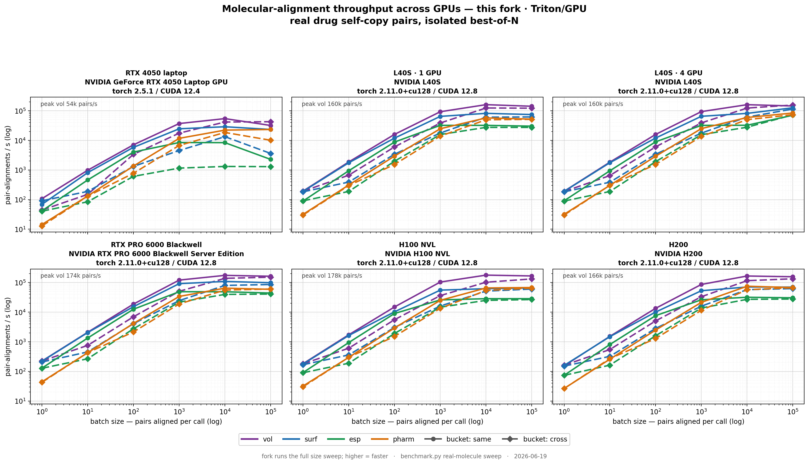
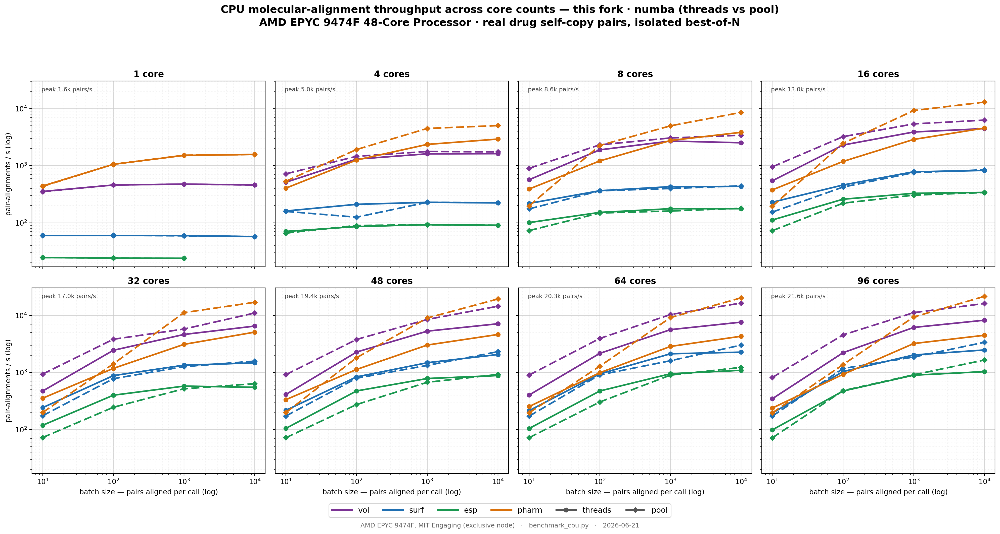

# What's New — GPU-Accelerated Batch Alignment

This fork adds a **Triton GPU engine** for molecular alignment on top of upstream
[`shepherd-score`](https://github.com/coleygroup/shepherd-score). It keeps the entire
original API and behavior, and adds opt-in, **additive** surfaces — the GPU/CPU
`backend=` seam, and an out-of-core streaming-screen module — that leave existing
behavior untouched.

- **One new public knob:** a `backend=` argument on the existing
  `MoleculePairBatch.align_with_*` methods — `"triton"` for the GPU path, or `"numba"`
  for an explicit CPU path. Nothing else in the public batch API changed.
- **Backward compatible:** the default backend is still the original JAX/CPU path, so
  existing code behaves exactly as before. Triton is an **optional** dependency — if it
  (or a GPU) isn't present, everything falls back transparently.
- **CPU too:** the *same* batched driver runs on a Triton-free **numba** kernel
  (`accel/kernels/cpu.py`) for CPU tensors — selected **per call by tensor device**
  (`accel/kernels/dispatch.py`), so it runs whether or not Triton is installed (CUDA tensors →
  Triton, CPU tensors → numba, in one process). Numerically exact and **~25× faster than
  the original per-pair CPU path** on `vol`. **Every batched mode now has a numba CPU path** —
  `esp_combo` was the last holdout and joined them via a fused ESP-comparison kernel (see
  [§ esp_combo fast backend](#esp_combo--fused-esp-channel--cpunumba-backend)).
- **Out-of-core screening:** a new top-level `shepherd_score.screen` module streams a
  precomputed, on-disk library of interaction profiles past a query through the
  *unchanged* batch API, so you can screen sets far larger than RAM (a billion
  `Molecule` objects ≈ ~10 TB). It is **purely additive — zero edits to any existing
  file**. See [§2 Streaming](#streaming--out-of-core-screening-libraries-larger-than-ram)
  and [`docs/STREAMING_DESIGN.md`](docs/STREAMING_DESIGN.md).
- **Mode rename (legacy preserved):** the two ESP alignment modes were renamed to clearer,
  self-describing names — **`esp` → `surf_esp`** (surface-ESP-weighted surface alignment) and
  **`esp_combo` → `vol_and_surf_esp`** (the ShaEP-style combined volume + shape + ESP scorer).
  The old names keep working **everywhere** as aliases, so existing code and on-disk stores are
  untouched. See [§ Mode rename](#mode-rename-esp--surf_esp-esp_combo--vol_and_surf_esp).
- **Mesh-free smooth surfacer (opt-in):** a new `surface_method="smooth_sdf"` on `Molecule`
  builds the surface point cloud **without Open3D** — it projects sampled points onto a smooth-min
  implicit iso-surface that rounds the concave atom-border "crimps", keeping the surface smooth +
  stochastic so it does not leak atom centers (for the generative pipeline). **Default is unchanged
  (`"mesh"`, the Open3D ball-pivoting surface).** A new `shepherd_score.surface_diagnostics` module
  quantifies crimp/leak for any surfacer. See
  [§2 Smooth surface](#mesh-free-smooth-surface-generative-pipeline).
- **Extending the engine (contributors):** [`docs/ADDING_A_FAST_MODE.md`](docs/ADDING_A_FAST_MODE.md)
  is a step-by-step guide for adding a new alignment/scoring mode to the fast backend — including
  the exact path **from a PyTorch autograd objective to a fused Triton+numba kernel** (factor into
  value/force/similarity, copy the verbatim `dR/dq` tail, validate `dO/dq` against
  `torch.autograd.grad`). A paste-ready agent brief with a literal kernel + numba-twin + driver
  code recipe lives in [`shepherd_score/accel/agent_prompt.md`](shepherd_score/accel/agent_prompt.md).
  Both encode the optimizations this fork relies on (in-register `dO/dq`, fused value+grad behind
  `NEED_GRAD`, `exp2`, per-call device dispatch, same-kernel self-overlaps, banded padding).

---

## 1. Organization — where the code lives

The acceleration is layered: hand-written GPU kernels at the bottom, batched optimizers
in the middle, and a thin integration seam at the top. Only the top layer is public.
**Genuinely new files are marked `NEW`; everything else is an existing upstream file that
was modified in place.**

```
shepherd_score/                         #  accel/ = 21 new modules, ~7,100 LOC total
├── accel/                              # ── NEW: all GPU/CPU acceleration, one subpackage
│   ├── kernels/                        #    Layer 1 — raw compute cores                  (~1,590 LOC)
│   │   ├── dispatch.py                     #  120 L  per-call device routing (Triton on CUDA, numba on CPU)
│   │   ├── shape_triton.py                 #  632 L  fused value+gradient shape (ROCS) overlap (Triton)
│   │   ├── esp_triton.py                   #  451 L  + ESP weighting + ShaEP ESP-comparison kernel (Triton)
│   │   ├── pharm_triton.py                 #  177 L  typed/directional pharmacophore value+SE(3) grad (Triton)
│   │   └── cpu.py                          #  632 L  numba CPU mirrors of every kernel (shape/ESP/pharm/color/ESP-compare)
│   ├── drivers/                        #    Layer 2 — batched coarse-to-fine SE(3) optimizers  (~3,550 LOC)
│   │   ├── _common.py                      #  460 L  batched SE(3) seed gen, quaternion ops, _update_best
│   │   ├── shape.py                        #  431 L  volumetric (atom-cloud) driver (also drives surf)
│   │   ├── surface.py                      #  391 L  surface-point driver
│   │   ├── esp.py                          #  490 L  ESP-weighted driver
│   │   ├── esp_combo.py                    #  671 L  ShaEP-style combo driver (fused ESP-comparison channel)
│   │   ├── pharm.py                        #  629 L  pharmacophore driver
│   │   └── pharm_overlap.py                #  476 L  pharmacophore overlap scoring (pure PyTorch)
│   ├── batch/                          #    Layer 3 — batch orchestration (package)       (~1,300 LOC)
│   │   ├── _pad.py                         #  140 L  size bucketing / sub-batching / scatter-fill
│   │   ├── _dispatch.py                    #  126 L  multi-GPU sharding + CPU-pool tensor spec
│   │   └── aligners.py                     # 1010 L  the six _align_batch_* drivers
│   ├── cpu_pool.py                         #  214 L  persistent multi-core CPU (numba) process pool
│   └── multi_gpu.py                        #  432 L  explicit one-process-per-GPU data-parallel driver
│
├── container/                          # ── integration (existing upstream files; the public seam)
│   ├── _batch.py   → MoleculePairBatch     # modified: PUBLIC seam align_with_*(backend="triton"/"numba")
│   ├── _core.py    → MoleculePair          # modified: binds accel.batch._align_batch_* onto MoleculePair;
│   │                                       #   opt-in per-pair fast path (use_fast); Molecule(surface_method=)
│   └── __init__.py                         # modified: exports align_multi_gpu / MultiGPUAligner
├── screen.py  → ProfileStore/MoleculeProfile/screen()  # ── NEW: out-of-core streaming screen
│                                           #   (0 edits to existing files; reuses the batch API by duck typing)
└── surface_diagnostics.py → leak/crimp metrics  # ── NEW: validate any surfacer for atom-leak (Open3D-free)
```

> `screen.py` and `surface_diagnostics.py` are **new top-level modules**, not part of the `accel/`
> subpackage, and they change no existing file — so the "21 new `accel/` modules" and "6 modified
> upstream files" accounting below is unchanged. Tests: [`tests/test_screen.py`](tests/test_screen.py),
> [`tests/test_smooth_surface.py`](tests/test_smooth_surface.py).

**Why this shape.** The speedup is a *batch* phenomenon — it comes from optimizing many
pairs at once in a single GPU dispatch, which amortizes the per-pair Python/launch
overhead. So the public entry point is the **batch** container (`MoleculePairBatch`); the
per-pair `MoleculePair` is a public class whose batch-orchestration helpers
(`_align_batch_*`) are private internals re-exported from the new `accel/batch/`. The
kernels and optimizers are pure internals, gated behind a `try/except ImportError` so the
package imports fine without Triton, and each batched driver additionally falls back to a
**numba CPU** implementation (`accel/kernels/cpu.py`) when Triton is unavailable. All six mode
drivers import and run on a CPU-only box; the validated CPU aligners are
`vol`/`vol_esp`/`surf`/`esp`/`pharm`/`esp_combo` — `esp_combo`'s ESP channel is the fused
value-only `esp_comparison_batch` kernel (Triton + numba), so it is no longer GPU-only.

### Changes to existing upstream files

The 21 modules under `accel/` are **new** -- a brand-new subpackage, so upstream's
`score/`, `alignment/utils/`, and `container/` file sets are otherwise untouched.
Beyond them, the fork modifies only **6 existing upstream files**; the table below
accounts for every one (Δlines = real diff vs
[`coleygroup/shepherd-score`](https://github.com/coleygroup/shepherd-score)). No
upstream file was deleted, and `alignment/_torch.py` is byte-identical to upstream.

| File | Δlines | What changed |
|---|--:|---|
| `container/_batch.py` | +299 | **The public seam.** Adds `_TRITON_BACKENDS` / `_NUMBA_BACKENDS`, the `_triton_align()` router and a `_prepare_numba()` guard, plus a `backend="jax"` (default) argument on every `align_with_*` method (and a new `align_with_esp_combo` batch method). `backend` in `{"triton","cuda","gpu"}` routes to the batched GPU path; `{"numba","cpu"}` runs that same batched driver on CPU; `"jax"` runs the original path unchanged; any other value raises. |
| `container/_core.py` | +272 / −4 | Binds the `_align_batch_*` static methods (defined in `accel/batch/`) onto `MoleculePair`; adds an **opt-in** `use_fast=False` kwarg gating the per-pair Triton fast path on `align_with_esp` / `esp_combo` / `pharm` (default preserves the original torch/analytical behaviour and honours `use_analytical`); adds a `score_with_vol()` helper; adds the opt-in `Molecule(surface_method='mesh')` kwarg threaded to `get_pc` (default `'mesh'` unchanged; `'smooth_sdf'` selects the mesh-free surfacer, `density` mode stays mesh-only). |
| `alignment/utils/se3.py` | +35 / −20 | Adds the batched SE(3) builder `quaternions_to_SE3_batch` (the GPU write-back uses it) and reworks `apply_SE3_transform` to a single fused `baddbmm`; the upstream parameter name (`SE3_transform`) and shape-validation checks are retained. |
| `container/__init__.py` | +7 / −1 | Exports the explicit multi-GPU driver `align_multi_gpu` / `MultiGPUAligner` (defined in `accel/multi_gpu.py`). |
| `generate_point_cloud.py` | +210 / −2 | **(1)** Makes the Open3D import **lazy** (`from __future__ import annotations` + a `_LazyOpen3D` proxy). Open3D is a ~30 s cold import and is fork-hostile (it breaks a later `fork`+CUDA), so deferring it keeps `import shepherd_score` fast and lets the fork-based multi-GPU pool work; behaviour is identical on first real surface use. **(2)** Adds the **opt-in mesh-free smooth surfacer** (`get_molecular_surface_smooth_sdf` + the `_farthest_point_sample` / `_get_masked_surface_candidates` / `_smoothmin_sdf_project` helpers) and a `method=` dispatch on `get_molecular_surface`. `method='mesh'` (default) is the original ball-pivoting code, **unchanged** and the out-of-the-box default; the opt-in `'smooth_sdf'` path (alias `'fast'`) imports **no Open3D**. |
| `protonation/protonate.py` | +2 | Adds `from __future__ import annotations` (no behaviour change). |

---

## 2. Format & usage

### Quick start

```python
from shepherd_score.container import Molecule, MoleculePair, MoleculePairBatch

# Build a batch of pairs (each pair = a reference + a fit molecule)
pairs = [MoleculePair(ref, fit) for ref, fit in my_pairs]
batch = MoleculePairBatch(pairs)

# The ONLY thing that changes between engines is the `backend=` argument.
scores, aligned = batch.align_with_surf(alpha=0.81)                     # default: original JAX/CPU
scores, aligned = batch.align_with_surf(alpha=0.81, backend="triton")   # GPU (Triton)  — aliases "cuda"/"gpu"
scores, aligned = batch.align_with_surf(alpha=0.81, backend="numba")    # fast CPU (numba) — alias "cpu"
```

**Which backend?**

| You want… | Use | What it does |
|---|---|---|
| Exactly the upstream behavior (no new deps) | *(omit `backend`)* or `backend="jax"` | Original per-pair JAX/XLA CPU path. |
| Maximum throughput on a CUDA GPU | `backend="triton"` | Batched coarse-to-fine drivers on the Triton GPU kernels. |
| A fast CPU run (no GPU, or to keep the GPU free) | `backend="numba"` | The **same** batched drivers, run on the numba CPU kernels. ~25× over the original CPU path on `vol`. |

`backend="numba"` forces every pair onto CPU and **works on any machine** — even a GPU box with Triton installed — because the kernel is chosen *per call by tensor device* (CPU→numba, CUDA→Triton). So you don't have to uninstall Triton to get a deterministic CPU pass. (As of this update **every mode, including `esp_combo`, has a numba CPU path** — `esp_combo`'s ESP channel runs on the fused `esp_comparison_batch` kernel.)

- `scores` → `np.ndarray` of shape `(N,)`.
- Results are also written **in place** on each pair (e.g. `pair.sim_aligned_surf`,
  `pair.transform_surf`), exactly as in the original API.
- `backend` accepts `"jax"` (default), `"triton"` (GPU; aliases `"cuda"`/`"gpu"`), or
  `"numba"` (explicit CPU; alias `"cpu"`); the alias sets are
  `_TRITON_BACKENDS = ("triton", "cuda", "gpu")` and `_NUMBA_BACKENDS = ("numba", "cpu")`.
- `return_aligned=True` (Triton path) also returns the transformed coordinates; it's
  `False` by default to skip that work when you only need scores + transforms.

### Multi-GPU

The alignment is **host-bound**, so driving N GPUs from one process serialises the per-pair
host work on the GIL and tops out at ~1–2×. The path that scales is **one OS process per
GPU** — each worker owns a shard, rebuilds its tensors on its own GPU, and runs the
*unmodified* aligner, so the host work parallelises too. **Verified 3.50–3.79× on 4×L40S
(node3615), bit-exact vs single-GPU** (vol 3.58×, surf 3.50×, esp 3.79×, pharm 3.63×).

- **`MultiGPUAligner` — the multi-GPU path** (`shepherd_score.accel.multi_gpu`, also exported
  from `shepherd_score.container`). A persistent one-process-per-GPU **pool**: it builds each
  GPU's shard once and aligns the resident data on every call (CPU threads capped to
  `cores/ndev` to avoid MKL/OMP oversubscription — the lever that otherwise collapses scaling
  to <1×), so repeated screening runs at the full steady-state scaling above.

  ```python
  from shepherd_score.container import MoleculePair, MultiGPUAligner
  pairs = [MoleculePair(a, b, device="cpu") for a, b in mols]   # build on CPU first
  with MultiGPUAligner(pairs) as pool:                          # one process per GPU
      vol_scores, _ = pool.align("vol", alpha=0.81)
      esp_scores, _ = pool.align("esp", alpha=0.81, lam=0.3)
  ```

  `align_multi_gpu(pairs, mode, ...)` is the one-shot equivalent for a single huge batch.

- **Transparent `align_with_*` does not silently shard.** A plain call on a multi-GPU box runs
  on a **single GPU** (with a one-time pointer to `MultiGPUAligner`): a library can't safely
  `spawn` worker processes behind your back, because `spawn` re-imports your `__main__` module
  and breaks any entry script lacking an `if __name__ == "__main__":` guard. Opt in with
  `FSS_MGPU_BACKEND=process` to route the transparent path through the (bit-exact) process
  backend from a guarded script.

The earlier **thread-sharding** default (GIL-bound, ~1.0–2.3×) has been **removed**.

### Streaming / out-of-core screening (libraries larger than RAM)

`MoleculePairBatch` and the multi-GPU drivers assume the whole pair list fits in host
RAM. At ~10 KB per `Molecule` (the RDKit `Mol` is ~⅔ of it), that wall is ~25 M molecules
on a 256 GB node — a billion-molecule library is ~10 TB. The new **`shepherd_score.screen`**
module screens libraries of effectively unbounded size: precompute each molecule's numeric
interaction profile **once**, persist it to a sharded on-disk store, then stream shards back
through the **unchanged** `align_with_*` / `align_multi_gpu` API — only one shard is resident
at a time.

It is purely additive — **zero edits to any existing file**. A new `MoleculeProfile` (an
RDKit-free, duck-typed stand-in for `Molecule` holding just the arrays the aligners read)
drops the RDKit `Mol`, which is what keeps shard reload at array-copy speed — storing/reloading
`Mol`s would cost ~5–15 s per 100 k shard, dwarfing the ~1 s GPU alignment of that shard. The
batched kernels, size-bucketing, GPU-memory sub-batching, and every backend are reused as-is.

```python
from shepherd_score.container import Molecule
from shepherd_score.screen import ProfileStore, screen, screen_many

# 1) BUILD THE STORE ONCE — the real cost at scale is this profile construction, not the
#    alignment (see docs/MOLECULE_CONSTRUCTION_PROBLEM.md; use surface_method="smooth_sdf"
#    to build it ~3–4× faster and Open3D-free). A store dir is single-writer; for a cluster
#    build give each worker its OWN store dir and screen across them (shards are independent).
with ProfileStore.create("library.fss", num_surf_points=200,
                         modes=("surf", "esp", "pharm"),   # only these arrays are stored
                         dtype="float16") as store:         # fp16 ≈ 2 TB for 1e9; fp32 ≈ 4 TB
    for mol in library_rdkit_mols:
        store.add(Molecule(mol, num_surf_points=200, pharm_multi_vector=False,
                           surface_method="smooth_sdf"))

# 2a) SCREEN ONE QUERY — streamed; the library is never all in RAM at once.
query = Molecule(query_mol, num_surf_points=200, pharm_multi_vector=False,
                 surface_method="smooth_sdf")
hits = screen(query, ProfileStore.open("library.fss"), mode="esp",
              lam=0.3, num_repeats=50, top_k=1000)    # backend auto: triton on GPU, numba on CPU
hits[0].score, hits[0].id, hits[0].transform          # best match; hits sorted desc

# 2b) SCREEN A QUERY PANEL — each shard is read ONCE and aligned against EVERY query
#     (the library streams once for the whole panel, not once per query).
panel = screen_many([q1, q2, q3], store, mode="esp", lam=0.3, top_k=1000)   # panel[j] = query j's hits

# multi-GPU: persistent one-process-per-GPU pool, spawned ONCE, that streams shards
# (NOT respawned per shard). Fast modes: all seven (vol/vol_esp/surf/esp/pharm/vol_color/esp_combo).
hits = screen(query, store, mode="vol", ndev=4, top_k=1000)

# ROCS/ROSHAMBO-style shape + directionless-color (vol_color): needs only a pharm
# store (atoms + pharmacophore anchors); no surfaces required.
hits = screen(query, store, mode="vol_color", color_weight=0.5, top_k=1000)

# full score vector (restart-friendly): every score in library order to a memmap (single-process)
import numpy as np
allscores = np.memmap("scores.f32", mode="w+", dtype="float32", shape=(len(store),))
screen(query, store, mode="esp", scores_out=allscores, top_k=1000)
```

**The engine (what removes the streaming-layer bottlenecks).** For **all seven fast modes**
(`vol/vol_esp/surf/esp/pharm/vol_color/esp_combo`) on a pre-centered store, `screen()`/
`screen_many()` take a **direct array → kernel** path: each shard's fit arrays are loaded **once**
as device tensors and the batched aligner (`_align_batch_*`) is fed lightweight `_FastPair`s whose
fit tensors are *views* into them and whose ref tensors are the *shared* query — **no per-molecule
`MoleculeProfile`/`MoleculePair`, no numpy→torch per pair**. (`vol_esp` and `esp_combo` joined this
direct path in this update — see
[§ Screen fast-path for `vol_esp` and `esp_combo`](#screen-fast-path-for-vol_esp-and-esp_combo);
they previously fell back to per-pair construction, and `vol_esp` screening crashed outright.)
Concretely:
- **`screen_many` (query panels)** builds each shard's fit tensors once and swaps only the query
  across the panel, so the library is read once per *campaign*, not once per query.
- **`ndev>1`** uses a persistent shard-parallel pool (one process per GPU, spawned once, shards
  pulled off a queue) instead of re-spawning workers per shard.
- **Shared-query self-overlap once per bucket.** Every pair in a size-bucket shares the same query,
  so the query self-overlap (the Tanimoto denominator term) is identical across rows; the
  `vol`/`surf` batched aligners now detect the shared ref by identity and compute it **once**, then
  broadcast — bit-identical, K−1 fewer self-overlaps per shard.

Notes:
- **`modes=` decides what's stored.** Only the arrays the listed modes need are written
  (`"vol"` works from *any* store — `atom_pos` is always kept; `vol_color` needs only a pharm
  store, no surfaces). Valid: `vol vol_esp surf esp pharm esp_combo vol_color`.
- **fp16 storage** (default) halves disk + IO at ~0.01 Å error — the surface-resampling noise
  floor — and is upcast to fp32 in RAM; pass `dtype="float32"` for an exact store.
- **`pre_centered=True`** (default) centers each profile to its own COM at build time, so the
  screen runs `do_center=False` (RDKit-free) yet matches `MoleculePair(do_center=True)`
  global-alignment semantics; the query is auto-centered once (a copy — the caller's query is
  never mutated). The fast path requires a pre-centered store.
- Surface `alpha` defaults to `ALPHA(num_surf_points)` for `surf`/`esp` (keeping the
  calibration correct); `lam`, `num_repeats`, `similarity`, … pass straight to the aligner.
- The fast direct path is **score-equivalent to the per-pair object path** on identical inputs,
  and a panel screen equals per-query screens (`tests/test_screen.py`). Design + rationale:
  [`docs/STREAMING_DESIGN.md`](docs/STREAMING_DESIGN.md); the one-time build cost it feeds:
  [`docs/MOLECULE_CONSTRUCTION_PROBLEM.md`](docs/MOLECULE_CONSTRUCTION_PROBLEM.md).

### Screen fast-path for `vol_esp` and `esp_combo`

This update extends the streaming-screen **direct array → kernel** path (above) to the two modes
that were still on the slow per-pair fallback, so **all seven modes now screen on the fast path**.
`esp_combo` screening was correct but paid per-molecule `MoleculeProfile`/`MoleculePair`
construction every shard; `vol_esp` screening **crashed** — it reconstructed heavy-atom charges
from a with-H store with a mismatched CSR offset. Both are fixed and verified bit-identical to the
slow path.

- **What it does (no signature change).** `screen(query, store, mode="vol_esp", lam=…)` and
  `screen(query, store, mode="esp_combo", alpha=…)` now build `_FastPair`s straight from the shard
  arrays — no per-molecule object construction — exactly like the other five fast modes (so
  `screen_many` panels, `ndev>1`, `scores_out=` all apply unchanged). `esp_combo` covers **both**
  shape channels: volumetric (`alpha=0.81`, heavy-atom centers) and surface-shape (`alpha=ALPHA`).
- **Files adjusted (this workstream):**
  - [`shepherd_score/screen.py`](shepherd_score/screen.py) — registered both modes in
    `_FAST_MODES`/`_NEEDS_ARRVIEW` and extended the per-mode fast-path helpers
    (`_query_ref_arrays`, `_ref_tensors_from_arrays`, `_build_fit_fast_pairs`, `_fast_batch_kwargs`)
    plus the `_FastPair`/`_ArrView` storage. The two non-obvious bits: the `vol_esp` heavy-charge
    reconstruction from a with-H store (`charges[all_off][nonH[atom_off]]`, matching the slow path's
    `partial_charges[_nonH_atoms_idx]`), and giving the `esp_combo` `_ArrView` a `_MolShim` + `radii`
    because the batched aligner reads `mol.GetConformer().GetPositions()` / `.radii` **eagerly** (as
    `_ensure(...)` source arguments) even when the cached tensor makes them unused.
  - [`shepherd_score/accel/batch/aligners.py`](shepherd_score/accel/batch/aligners.py) — the
    **shared-query self-overlap hoist** for the `vol`/`surf` batched aligners (one self-overlap per
    bucket instead of one per pair; see the bullet above).
- **Parity (bit-identical to the slow per-pair screen path).** On a 60-molecule float32 store, the
  slow vs fast `screen()` checksums match exactly, self-hit `1.000`:

  | mode | shape channel | slow `CHECKSUM` | fast `CHECKSUM` |
  |---|---|--:|--:|
  | `vol_esp`   | —                      | 26.47480655 | 26.47480655 |
  | `esp_combo` | surface (`alpha=ALPHA`) | 24.23063995 | 24.23063995 |
  | `esp_combo` | volumetric (`alpha=0.81`) | 26.57599893 | 26.57599893 |

  The slow `vol_esp` path is also a pre-existing bug surfaced here (heavy-charge offset mismatch
  against a with-H store); the fast path reads the stored arrays directly and screens correctly. One
  library molecule with `len(atom_pos) ≠ len(_nonH_atoms_idx)` (a data inconsistency) is filtered.

### Mesh-free smooth surface (generative pipeline)

`Molecule(..., surface_method="smooth_sdf")` builds the surface point cloud **without Open3D**. The
default is unchanged — `surface_method="mesh"` is the original Open3D ball-pivoting + Poisson surface
(same code path).

Why it exists: the surface fed to the **generative** model must be *smooth* and *stochastic* so a
network can't read atom centers off it (a "leak"). A point sitting exactly on an atom's (vdW+probe)
sphere reveals that atom's position, and the concave seams where two spheres meet ("crimps") mark the
atom borders. The mesh path hides these by meshing + resampling; `smooth_sdf` does it mesh-free:
sample the union-of-spheres envelope (stochastic) → project the points onto a **smooth-min implicit
iso-surface** that rounds the crimps → even (farthest-point) resample to the exact count.

```python
from shepherd_score.container import Molecule

# Default is unchanged — the original Open3D ball-pivoting mesh surface:
mol = Molecule(rdkit_mol, num_surf_points=200)            # surface_method="mesh"

# Opt in to the mesh-free smooth + stochastic surface (no Open3D needed); "fast" is an alias:
mol = Molecule(rdkit_mol, num_surf_points=200, surface_method="smooth_sdf")  # or "fast"
```

- **Tunable** via `generate_point_cloud.get_molecular_surface_smooth_sdf(..., s=, iters=, knn=,
  jitter=, even=, num_samples_per_atom=, seed=)` (defaults in the `SMOOTH_SDF_*` module constants).
  `s` is the smooth-min sharpness: smaller rounds the crimps more / pushes points farther off the
  spheres (less leak); larger → sharp on-sphere union. The default `s=10` reproduces the mesh
  surface's ~0.010 Å off-sphere level. The smooth path samples a sparser candidate cloud than the
  mesh (`SMOOTH_SDF_NSPA=15` vs 25 — it doesn't need a dense cloud to mesh), which ~halves the cost
  at the same blue-noise evenness.
- **Stochastic** by default (varies run-to-run, like the unseeded Poisson resample); pass `seed=`
  for a reproducible surface.
- **Validate any surfacer** with the new `shepherd_score.surface_diagnostics` module
  (`leak_metrics`, `crimp_points`, `center_recovery_attack`, `summarize`) — all Open3D-free.
  Measured at the default on drug-like molecules: median off-sphere ~0.005–0.012 Å (vs the mesh's
  ~0.010 Å), and an atom-center **recovery-attack** error of ~0.06–0.09 Å versus **0.000 Å** for an
  on-sphere surface — i.e. the smooth surface hides atom centers; an on-sphere / FPS surface does not.
- **Speed.** End-to-end ~3–4× faster than the mesh surface on drug-sized molecules (~12–18 ms vs
  ~54 ms; the implicit-surface projection replaces the ~50 ms ball-pivoting, and the sparser
  candidate cloud shrinks the remaining sampling + farthest-point-resample cost).
- **Open3D-free at the call level.** The `smooth_sdf`/`fast` surfacer imports **no Open3D**, so a
  surface build via `Molecule(..., surface_method="smooth_sdf")` never triggers Open3D's ~30 s cold
  import or its fork-hostility — useful for a forked, multi-process generative precompute. (Open3D
  remains a normal dependency for the **default** `mesh` surface; if you want a run that never even
  imports it, build `Molecule(surface_method="smooth_sdf")` directly rather than going through
  `objective.py` / `extract_profiles.py`, which import Open3D eagerly at module load as upstream does.)

> **Caveat — opt-in for a reason.** Using `smooth_sdf` on the generative path is a distribution
> shift versus a diffusion model trained on the Open3D mesh surface (the model lives in the separate
> [`coleygroup/shepherd`](https://github.com/coleygroup/shepherd) repo). The Open3D-free checks above
> are necessary but **not sufficient**; the binding gate is the external `ConditionalEval` / retrain
> on the new surfacer's output. Tests: [`tests/test_smooth_surface.py`](tests/test_smooth_surface.py).

### The backend matrix

Every alignment mode is reachable from the batch API across all three backends:

| Mode (`MoleculePairBatch` method) | `backend="jax"` (default) | `backend="triton"` (GPU) | `backend="numba"` (CPU) |
|---|:--:|:--:|:--:|
| `align_with_vol`       (shape, heavy-atom)        | ✓ | ✓ | ✓ |
| `align_with_vol_esp`   (shape + ESP, heavy-atom)  | ✓ | ✓ | ✓ |
| `align_with_surf`      (surface shape)            | ✓ | ✓ | ✓ |
| `align_with_esp`       (surface + ESP)            | ✓ | ✓ | ✓ |
| `align_with_pharm`     (pharmacophore)            | ✓ | ✓ | ✓ |
| `align_with_esp_combo` (ShaEP-style combo)        | ✓ | ✓ | ✓ |

Notes:
- **`backend="numba"`** (alias `"cpu"`) runs the *same* batched coarse-to-fine drivers
  as the Triton path, but with the numba CPU kernels instead of Triton. It forces every
  pair onto CPU and **works on any box** — including a GPU box where Triton is installed —
  because kernel selection is **per call, by tensor device** (`accel/kernels/dispatch.py`):
  CUDA tensors dispatch to Triton, CPU tensors to numba, in the same process. This lets you
  reserve the GPU for another task or run a deterministic CPU pass without uninstalling
  Triton. (Numerically exact vs the Triton path: GPU-vs-CPU agreement ~1e-3, self-copy
  stays 1.000.) All five modes (`vol`/`vol_esp`/`surf`/`esp`/`pharm`) run the numba batched
  kernel on CPU; `pharm` falls back to the per-pair legacy optimizer only when numba is
  absent. (The batched `pharm` aligner now **centers each pair's clouds** before the
  coarse-to-fine optimization — a translation-invariant fix that recovers self-copy to
  ~1.0 even for molecules with very few pharmacophores, on both backends, at no throughput
  cost; this also removes a `numba`-vs-`triton` basin divergence in that regime.)
  `esp_combo` now also runs on numba — its shape channel is the shared numba overlap
  kernel and its ESP channel is the fused `esp_comparison_batch` numba kernel (see
  [§ esp_combo fast backend](#esp_combo--fused-esp-channel--cpunumba-backend)).
- The Triton/numba `vol`/`vol_esp` backends align **heavy atoms only** (`no_H=True`); passing
  `no_H=False` raises `NotImplementedError`.
- `max_num_steps` maps to the Triton optimizer's fine-step count.
- The `esp` `lam` weighting is scaled identically across backends; `vol_esp` uses raw
  `lam`, matching the per-pair `MoleculePair.align_with_vol_esp`.
- **Per-pair container API:** the per-pair `MoleculePair.align_with_esp/esp_combo/pharm`
  default to the original torch path and honor `use_analytical`. The per-pair Triton fast
  kernel is **opt-in** via `use_fast=True` — it is no longer auto-selected just because a
  CUDA device is visible (this keeps the per-pair default behavior identical to upstream).
  The batch `backend=` argument above is the primary, fully backward-compatible GPU entry
  point.

### Requirements

The GPU path needs a CUDA device plus [`triton`](https://github.com/triton-lang/triton)
and a CUDA build of PyTorch; the CPU fallback for the batched drivers uses
[`numba`](https://numba.pydata.org/). Both are **optional extras** declared in
`pyproject.toml`:

```bash
pip install shepherd-score[gpu]   # triton  — GPU Triton kernels
pip install shepherd-score[cpu]   # numba   — CPU fallback for the batched drivers
```

`triton` is guarded behind a `try/except ImportError` and `numba` is imported lazily (only
when the CPU fallback actually runs), so with neither installed `import shepherd_score` still
succeeds and the original per-pair JAX/CPU path runs exactly as before.

**Open3D stays a required dependency** (as upstream), since it powers the **default** `mesh`
molecular surface. The opt-in `surface_method="smooth_sdf"` (alias `"fast"`) surfacer needs no
extra dependency and imports no Open3D itself — so it's both faster and Open3D-free at the call
level — but it does **not** change the default or remove the Open3D requirement.

---

## 2b. New alignment mode — `vol_color` (ROCS/ROSHAMBO-style shape + directionless color)

A new first-class alignment mode that mirrors **OpenEye ROCS** and **ROSHAMBO2**: it overlays
two molecules by jointly optimizing **atom-centred Gaussian shape** + **directionless
pharmacophore "color"**, and reports a weighted combined Tanimoto (the `TanimotoCombo`
analogue). It is **purely additive** — every existing scorer/aligner default is byte-identical.

### What it computes

$$\text{score} \;=\; (1-w_{\text{color}})\cdot \text{Tanimoto}_{\text{shape}} \;+\; w_{\text{color}}\cdot \text{Tanimoto}_{\text{color}}$$

- **Shape** — atom-centred Gaussian volume overlap (`alpha=0.81`, heavy atoms), the same
  Grant–Pickup form as the `vol` mode (≈ ROSHAMBO's `KAPPA/1.7²`). Scored by Tanimoto.
- **Color** — per-type Gaussian overlap of pharmacophore features, **same-type only**, scored
  *directionless*: each feature is an **isotropic point Gaussian** with no orientation vector
  (exactly ROCS "color atoms" / ROSHAMBO's RDKit-feature color). At `alpha=1.0` a color pair's
  overlap is numerically identical to ROSHAMBO2's `exp(-½d²)(π/2)^{3/2}`.
- **`color_weight`** (default `0.5`) is the ROCS/ROSHAMBO 50/50 mix; the joint objective is
  optimized over SE(3) (not shape-then-rescore), like ROSHAMBO2's `optim_mode="combination"`.

> **Directionless ≠ zero vectors.** Feeding zero vectors through the directional scorer does
> *not* give directionless scoring — a zero vector yields cosine weight `(0+2)/3 = 2/3` on
> cross terms but `1` on self terms, which does **not** cancel in the Tanimoto. The mode routes
> every type through the genuine point-only overlap instead (the path the hydrophobe/ion types
> already use).

### ROCS color vs ROSHAMBO color — what `vol_color` follows

Both ROCS and ROSHAMBO descend from the same Mills–Dean pharmacophore lineage: ~6 **directionless**
"color" feature types (donor, acceptor, cation, anion, ring/aromatic, hydrophobe), scored by a
**same-type-only** Gaussian overlap + Tanimoto. They differ in three ways that matter for an
implementation choice:

| | **ROCS / FastROCS** (OpenEye) | **ROSHAMBO / ROSHAMBO2** (open) | **`vol_color` (this fork)** |
|---|---|---|---|
| Feature definitions | proprietary **Implicit Mills Dean** `.cff` SMARTS | RDKit **`BaseFeatures.fdef`** SMARTS | RDKit `BaseFeatures.fdef` (`feature_set='rdkit_base'`) — matches ROSHAMBO; or fss's own `.fdef` (`'shepherd'`) |
| Protonation / pKa | **implicit pKa model @ pH 7** (ionization inferred regardless of input); *Explicit* variant turns it off | **no pKa model** — uses the input protonation as-is | no pKa model (follows ROSHAMBO / ROCS-Explicit); standardize protonation upstream |
| Combine + optimize | `TanimotoCombo = shape + color` (0–2); default optimizes the **joint** shape+color overlay (`-optchem true`). FastROCS: shape-optimized + color scored at the inertial starts | `(1-m)·shape + m·color` (0–1); `combination` mode mixes the shape+color **gradient** | `(1-color_weight)·shape + color_weight·color`; **joint gradient** (matches ROSHAMBO2 `combination` and ROCS `-optchem true`) |

So `vol_color` follows the **ROSHAMBO** conventions (RDKit features, no pKa model, weighted
0–1 combo, joint-gradient optimization), and is feature-compatible with ROCS *Explicit* Mills
Dean. The main caveat for a faithful ROCS comparison is the **pKa model**: ROCS's default
Implicit Mills Dean can place different cation/anion/donor/acceptor atoms than the input
protonation implies, so standardize protonation before a head-to-head. (fss's color Gaussian
also keeps the per-type Pharao widths — α=1.0 except aromatic/hydrophobe=0.7 — vs ROCS's single
~1 Å width and ROSHAMBO's uniform α=1.0; a uniform-α ROCS preset is noted under future work.)

### How to use it

```python
from shepherd_score.container import Molecule, MoleculePair

# Build molecules with RDKit's stock BaseFeatures.fdef, as isotropic color atoms
# (the 6 ROCS/ROSHAMBO types: Donor, Acceptor, Aromatic, Hydrophobe, Cation, Anion).
ref = Molecule(rdmol_a, pharm_multi_vector=False, feature_set='rdkit_base', directionless=True)
fit = Molecule(rdmol_b, pharm_multi_vector=False, feature_set='rdkit_base', directionless=True)

mp = MoleculePair(ref, fit, do_center=True)
aligned = mp.align_with_vol_color(color_weight=0.5)   # ROCS-style combo
mp.sim_aligned_vol_color      # combined vol+color Tanimoto
mp.transform_vol_color        # optimal 4×4 SE(3)
```

New public surface (all defaults preserve existing behavior):

| API | What's new |
|---|---|
| `Molecule(..., feature_set='shepherd'\|'rdkit_base', directionless=False)` | `'rdkit_base'` uses RDKit's stock `BaseFeatures.fdef` reduced to the 6 ROCS/ROSHAMBO color types (`PosIonizable→Cation`, `NegIonizable→Anion`, `LumpedHydrophobe→Hydrophobe`); `directionless=True` emits zero-vector color atoms for **all** families. |
| `MoleculePair.align_with_vol_color(color_weight=0.5, alpha=0.81, similarity='tanimoto', directional=False, num_repeats=50, trans_init=False, lr=0.1, max_num_steps=200)` | The new mode (per-pair). Writes `sim_aligned_vol_color` / `transform_vol_color`. |
| `MoleculePairBatch.align_with_vol_color(..., backend='jax'\|'triton'\|'numba')` | Batched path: `"triton"` (CUDA) / `"numba"` (CPU) run the `accel/drivers/vol_color.py` driver; `"jax"` (default) runs the per-pair path sequentially. |
| `get_overlap_pharm(..., directional=True)` (torch + numpy) | `directional=False` scores all types as isotropic point Gaussians (ROCS color). |
| `get_pharm_combo_score(..., color_weight=0.5, directional=True)` (torch + numpy) | Weighted shape+color combo (`color_weight=0.5` == the previous unweighted average). |
| `optimize_vol_color_overlay(...)` / `objective_vol_color_overlay(...)` (`shepherd_score.alignment`) | The SE(3) optimizer/objective behind the mode (templated on the `esp_combo` combo path). |

### How it works internally

`vol_color` is the pharmacophore twin of the existing `esp_combo` blended-combo path. The
optimizer (`alignment/_torch.py::optimize_vol_color_overlay`) multi-starts SE(3) (identity + 4
principal-component + Fibonacci rotations, COM-aligned — the same inertial-frame starts ROCS
uses), runs Adam on the joint objective, and selects the best-scoring pose by the combined
similarity. Self-overlaps are recomputed every step, so the directionless self/cross terms stay
consistent (a `directional=False` + precomputed-self-overlap combination is rejected by design,
avoiding a Tanimoto-corrupting collision).

The **batched** driver (`accel/drivers/vol_color.py`, reached via
`MoleculePairBatch.align_with_vol_color(backend="triton"|"numba")`) is templated on
`esp_combo` and — like every other mode — runs **both channels on fused value/gradient
kernels** (Triton on CUDA, numba on CPU, via `accel/kernels/dispatch.py`):
- **shape** → the fused volumetric kernel (`overlap_score_grad_se3_batch`, the same one
  `vol`/`esp_combo` use); returns the overlap **value + quaternion gradient** `dO_s/dq`.
- **color** → a **specialized directionless color kernel** (`pharm_color_score_grad_se3_batch`,
  Triton + numba, built with `build_lookup_tables(directionless=True)`): a same-type-only
  isotropic Gaussian (per-type α/K, no vectors/weights) that takes the quaternion `q` directly
  and **emits `dO_c/dq` in-register** — the validated `dR/dq` tail of the shape kernel. Called
  with `NEED_GRAD=True`, so value + gradient come from **one launch** (no extra dispatch).

**Joint gradient (ROSHAMBO2 `combination` mode).** The SE(3) step descends on the full
combined objective `(1-w)·shape_T + w·color_T`, so **both** channels steer the pose. Because the
color kernel now emits `dO_c/dq` directly (in the *same* quaternion convention as the shape
kernel — q is unit each step, the adam renormalizes it), the combine is just
`(1-w)·(-scale_s·dQ_s) + w·(-scale_c·dQ_c)` and the whole host-side rotation→quaternion
projection tail is **gone** (no `apply_tanimoto_chain_rule` / `project_grad_R_to_quaternion` /
four `(PK,3,3)` Jacobians / normalization Jacobian / host `R`-build). The color kernel's `dQ`
is **validated to ~1e-17 against autograd** (and Triton-vs-numba to fp32 on an RTX 4050), and the
batched result matches the per-pair autograd
optimizer to 4 decimals on distinct molecules.

Padded pharmacophore slots are typed `Dummy` and masked by `N_real`, so padding is free.
Because both kernels device-dispatch, the whole driver runs on CPU (numba) too — which is how
it is unit-tested — and the per-pair `MoleculePair.align_with_vol_color(use_fast=True)` routes
through the same batched driver, exactly like `align_with_pharm`/`align_with_esp`.

### Status & tests

- **Both a per-pair path and a batched GPU/CPU driver ship, both on fused kernels, both
  joint-gradient.** `MoleculePair.align_with_vol_color` is the per-pair torch optimizer (joint
  autograd gradient; `use_fast=True` routes to the batched driver).
  `MoleculePairBatch.align_with_vol_color(backend=...)` runs the batched
  `accel/drivers/vol_color.py` driver — **shape** on the fused volumetric kernel and
  **directionless color** on the fused pharmacophore kernel
  (`build_lookup_tables(directionless=True)`), `"triton"` on CUDA / `"numba"` on CPU, with the
  **combined shape+color gradient** steering each SE(3) step (ROSHAMBO2 `combination` mode). Both
  recover self-copy **1.000** and agree to 4 decimals on distinct molecules.
- **Tested:** `tests/test_vol_color.py` — directionless torch↔numpy parity across sizes/
  similarities; directionless self-overlap = 1.0; the precompute guard; `color_weight` combos;
  RDKit `rdkit_base` featurization; the per-pair **and batched (numba, fused-kernel)**
  `align_with_vol_color` recovering Tanimoto **1.000** on real drug molecules. All existing tests
  pass unchanged.
- **Throughput (NVIDIA L40S, real drug self-copy pairs, `same` bucket, best-of-N).** Both
  modes recover self-overlap **1.000**:

  | pairs / call | 1 | 10 | 100 | 1,000 | 10,000 |
  |---|--:|--:|--:|--:|--:|
  | `vol_color` (joint gradient, **in-register color kernel**) | 114 | 1,131 | 10,476 | 60,155 | **95,638** |
  | `vol_color` (joint gradient, *eager projection* — prior) | 35 | 354 | 3,405 | 27,714 | 56,749 |
  | `vol` (shape only, reference) | 216 | 2,046 | 18,613 | 104,127 | **196,776** |

  With both channels on fused kernels — and the **directionless color kernel now emitting its
  SE(3) quaternion gradient in-register** (no host rotation→quaternion projection tail; see
  *How it works internally*) — `vol_color` reaches **~96k pairs/s** at 10k, **~1.7× the earlier
  eager-projection joint gradient** (~57k) and now within **~2× of pure shape**, so color is no
  longer the bottleneck. That is **~40× the original pure-PyTorch color implementation** (which
  plateaued ~2.4k) and **~32× ROSHAMBO2's combo (shape+color) mode** (~3.0k pairs/s on L40S,
  Fig 5) — the first open shape+color combo at this throughput. The joint gradient is now nearly
  free over a shape-gradient-only variant: the color kernel computes its SE(3) gradient in the
  *same* launch and already in quaternion space, so optimizing the true combined objective costs
  little. (On an RTX 4050 laptop GPU the same code reaches ~36k/10k, vs ~52k for `vol`.) (Batched
  sweep: `python -m benchmarks.benchmark --modes vol_color --no-original`; per-pair:
  `python -m benchmarks.benchmark_vol_color`.)
- **Future work:** a jax mirror of the mode, and a uniform-α ROCS color preset (single Gaussian
  width across types, vs the current per-type Pharao widths) for exact OpenEye/ROSHAMBO width
  parity. (The gradient-mixed batched optimizer — ROSHAMBO2 `combination` mode — is now done; see
  above.)

### Carried over to the other modes (`pharm` / `esp_combo` / `surface`)

The three optimizations behind `vol_color`'s speedup were audited against every other mode and
applied where they were missing (the shape-family modes — `vol`/`surf`/`esp`/`vol_esp` — already
had all three):

- **In-register `dQ` for `pharm` (the big one).** `pharm` was the *only* other mode still doing
  the per-step host rotation→quaternion projection tail (`apply_*_chain_rule` on a `(PK,3,3)`
  matrix → `project_grad_R_to_quaternion` → normalization Jacobian). A new **directional**
  `pharm_grad_dq_se3_batch` kernel (Triton + numba) takes the unit quaternion and emits `dO/dq`
  directly, reusing the validated shape `dR/dq` tail **twice** — once for the positional gradient
  (force ⊗ fit-anchor) and once for the directional **weight** gradient (Σⱼ coeff·ref-vec ⊗
  fit-vec, the cat-1/cat-2 term). The driver drops the matrix projection entirely (scaling
  `dO/dq` is identical to projecting-then-scaling, since the projection is linear). **Validated:
  numba `dQ` matches autograd to ~1e-17** (directional, incl. the weight gradient), **Triton ==
  numba to fp32** on an RTX 4050, **self-copy 1.000** (tanimoto + tversky), distinct molecules
  match the per-pair autograd optimizer. Measured **~1.4× at 10k / ~1.6× at 100–1k pairs** on an
  RTX 4050 (e.g. 24.3k → 33.7k pairs/s at 10k), the same projection-tail win `vol_color` saw on
  the L40S.
- **Early-stop override wiring.** `esp_combo` and `surface` were the only drivers not honoring the
  `FINE_ES_PATIENCE` env override (`esp`/`pharm`/`shape` already did). Now wired in both — a free
  consistency fix (no behavior change unless the env var is set). The patience-`5→2` *default* was
  **not** transferred: `esp`/`pharm`/`esp_combo`/`surf` deliberately keep `5` (they converge
  slower than the fast shape modes).
- **`exp2` in the directional `pharm` kernel.** The directional `pharm_triton` kernel was the last
  one still using `tl.exp`; switched to `tl.exp2(x·log₂e)` (hardware `ex2.approx`), matching the
  shape/esp/color kernels (bit-close; self-copy safe via the exact-cancellation identity).

### `esp_combo` — fused ESP channel + CPU/numba backend

`esp_combo` (the ShaEP-style shape + surface-ESP blend) was the **last mode without a CPU/numba
path** and the only one whose per-step ESP term still ran in eager PyTorch. Its inner loop scored
the ESP channel with two `_batch_esp_comparison` calls that each built a `(K, N_surf, M_atoms)`
`torch.cdist` distance tensor (`K = pairs × seeds`) — the dominant per-step cost on GPU and the
reason the CPU path was left disabled. This update closes both gaps:

- **Fused, value-only `esp_comparison_batch` kernel** (`accel/kernels/esp_triton.py` +
  `accel/kernels/cpu.py`, registered in `dispatch.py`). One CTA per pair streams field
  point × atom in registers — per surface point it accumulates the Coulomb ESP from the other
  molecule's atoms, the vdW+probe volume mask, and the Gaussian of the ESP difference — and never
  materializes the `(N_surf, M_atoms)` tensor. It is **value-only by design**: `esp_combo` steers
  the pose with the *shape* gradient and uses the ESP term only to score/select (FastROCS-style),
  so no `dO/dq` tail is needed and existing behavior is preserved exactly.
- **No redundant shape recompute.** The fine loop already computes the shape overlap `VAB` (with
  gradient) every step; it is now threaded into the combo score (`_batch_esp_combo_score(...,
  VAB_shape=VAB)`) instead of being recomputed by a second value-only shape-kernel launch. The
  now-unused `centers_2` fit-cloud transform was dropped.
- **numba backend enabled.** `MoleculePairBatch.align_with_esp_combo(backend="numba"/"cpu")` no
  longer raises — it routes through the same batched driver, and per-call device dispatch selects
  the numba twins (the shape numba kernel + the new ESP numba kernel) for CPU tensors.

**Validation.** The fused kernel reproduces the old `torch.cdist` math to **~2e-14** (numba, fp64)
and **~4e-7** (Triton, fp32); **Triton == numba to ~2e-7** (fp32). End-to-end, the speedup is
**behavior-preserving** — scores drift **~3e-8** vs the old path. The full batch/scoring/screen
suite (50 tests) passes on both backends, plus a new
`test_esp_combo_numba_cpu_and_matches_triton` regression test.

**Measured (RTX 4050 laptop).** The ESP channel itself (fused vs the old cdist math):
**~4.6× on numba** and **~23–27× on Triton** at fine-loop scale (`K = 5k–25k`, the kernel's
no-materialization win grows with batch). End-to-end, same driver with only the ESP channel
swapped (behavior-preserving before/after; numbers below from WSL, `SimModelEnv`, triton 3.6 /
numba 0.63):

| backend | batch | before (pairs/s) | after (pairs/s) | speedup |
|---|--:|--:|--:|--:|
| numba (CPU) | 100 | 43 | 102 | **2.4×** |
| Triton (GPU) | 100 | 143 | 538 | **3.8×** |
| Triton (GPU) | 1000 | 201 | 1216 | **6.1×** |

(Absolute pairs/s vary run-to-run: the small-batch GPU rows are launch-overhead-bound and subject
to laptop thermal throttle, and the numba row depends on core count/contention — Windows-native
`GNNenv` measures the CPU before/after at ~41 → ~130 pairs/s, **~3.2×**. The speedup *ratio* and the
~3e-8 score drift are stable across runs.) `esp_combo` is now a first-class fast-backend mode on
both Triton and numba, like the other ESP modes (and the `FINE_ES_PATIENCE` override wired in above
applies here too).

---

## 3. Strategies Used

The per-step speedups below were measured on a single RTX 4050 laptop GPU (best-of-N,
paired timing); the cross-GPU peaks are in **Net result** at the end. Throughput is in
aligned **pairs per second**; "bit-identical" means scores match the reference to the
last decimal.

### A. The engine — batched optimization (GPU + CPU)
1. **Triton value+gradient kernels** for shape, ESP, and pharmacophore
   overlap (`accel/kernels/shape_triton.py`, `accel/kernels/esp_triton.py`,
   `accel/drivers/pharm_overlap.py`, `accel/kernels/pharm_triton.py`). One CTA per pose
   computes the overlap *and* its SE(3) gradient in a single fused pass — replacing the
   per-pair CPU/JAX optimization loop.
2. **Batched coarse-to-fine SE(3) search.** Seed generation, the Adam fine-tuning loop,
   and per-pair selection all run over the whole batch on-GPU, so a 4,096-pair batch is one
   sequence of kernel launches instead of 4,096 independent optimizations.
3. **Multi-GPU = process-per-GPU.** The host-bound align doesn't scale with thread sharding
   (GIL-bound, ~1–2×; that default has been removed). The persistent one-process-per-GPU pool
   (`accel/multi_gpu.py` `MultiGPUAligner`) builds each GPU's shard once and reaches
   **3.50–3.79× on 4×L40S** (verified on node3615, bit-exact vs single-GPU). See **D**.
4. **CPU engine (numba) — the same batched driver, on CPU.** The batched drivers (all
   six modes, `esp_combo` included as of this update) have a numba (`@njit(parallel=True)`)
   value(+SE(3)-gradient) kernel (`accel/kernels/cpu.py`) that replicates the Triton kernel
   operation-for-operation.
   Kernel choice is **per call, by tensor device** (`accel/kernels/dispatch.py`): CUDA tensors run
   the Triton kernels, CPU tensors the numba ones — so the numba path runs whenever the data
   is on CPU, whether or not Triton is installed (e.g. `backend="numba"` on a GPU box). It is **numerically exact** (computes the true
   overlap+gradient; not bit-identical, since `math.exp` ≠ Triton's `exp2`), so self-copy
   stays 1.000 and distinct-pair scores match. This is a real speedup of the CPU path, not
   just a safety net: on `vol` it reaches **~161 pairs/s/core, ~25× over the original torch
   per-pair CPU path** (and ~5–15× over JAX-batch single-core); `vol_esp` ~162–182/core,
   `pharm` **~237/core** (the numba pharm kernel, ~20× over the previous per-pair-legacy CPU
   fallback). The compute-bound surface modes (`surf`/`esp`) stay slow *per core* — they are
   FLOP-bound on `exp` — but they parallelise well: across 96 cores they reach ~3.4k / 1.7k
   pairs/s (see **Net result (CPU — multi-core)** below). The GPU path is untouched: for CUDA tensors the dispatcher always
   selects the Triton kernels (the previous behavior). (A push for >2,000 pairs/s/core was explored and
   found physically out of reach for `surf`/`esp` — they are bound by per-core `exp` throughput.)

### B. Kill the per-pair overhead
5. Profiling showed the alignment was **overhead-bound, not kernel-bound**: per-call setup
   dominated while the kernel was <20% of the time. The fix was to **vectorize the
   per-pair Python loops** — a single host→device fill for real-atom counts and a
   **batched SE(3) write-back** (`quaternions_to_SE3_batch`) instead of one matrix-build
   call per pair. This is pure data movement, so it is **bit-identical**:

   | mode | before | after | speedup |
   |---|--:|--:|:--:|
   | vol  | 5,260 | **18,367** | 3.5× |
   | surf | 2,545 | **16,342** | 6.5× |
   | esp  | 1,673 | **6,199**  | 3.7× |

6. **Batched pad-fill** of the workspace tensors (instead of per-pair GPU
   copies) — also bit-identical: vol **18.4k → 26k**, surf **16k → 18.2k**.
7. **F3 — finish the job (`_scatter_fill`).** Profiling showed step 6's pad-fill
   was *itself* the single largest cost — *bigger than the kernel* for vol. Replacing every
   per-pair fill with one batched `torch.cat` + a vectorized scatter (launch count O(1) in the
   batch size instead of O(K)), plus a single `tolist()` score write-back, is pure data movement
   and **bit-identical**:

   | mode | before | after | speedup |
   |---|--:|--:|:--:|
   | vol   | 23,700 | **54,800** | 2.3× |
   | surf  | 16,500 | **28,900** | 1.76× |
   | esp   | 5,700  | **8,000**  | 1.4× |
   | pharm | 6,200  | **11,800** | 1.9× |

   This is what made the align **GPU-bound** — host down to ~4 µs/pair (under the 10 µs/pair =
   100k-pairs/s target), lifting the host ceiling that had been capping GPU scaling.

### C. Accuracy-safe kernel & loop tuning
8. **Early-stop trim** (patience 5→2) for the shape/surface modes, which converge fast —
   bit-identical, ~1.15× (vol) / ~1.28× (surf). (ESP/pharm keep patience 5; they converge
   slower.) This is exposed as a tunable (`FINE_ES_PATIENCE`) used by the speed-lab harness.
9. **Kernel occupancy & schedule tuning.** Small tiles (one warp per CTA) suit the tiny
   per-pose problems; the BLOCK size and kernel schedule (`num_warps`, `num_stages`) are now
   selected per problem shape via `@triton.autotune` and validated to be bit-identical.
10. **Per-mode default seed/step counts, accuracy-tuned** (2026-06). Swept `(num_seeds ×
    fine-steps)` for all seven modes against the fully-converged reference on 200 distinct
    drug cross-pairs (`benchmarks/optimize_defaults.py` → `analyze_defaults.py`), keeping the
    cheapest setting that still captures **≥99.9% of the converged mean overlap** (with a
    bounded per-pair tail and intact self-copy recovery; alignment scores are
    backend-independent, so the knees found on the numba CPU sweep transfer to the Triton GPU
    path). Two outcomes. **(a) Steps were the big waste:** every mode converges by ~40–50 fine
    steps, so the public `max_num_steps` default drops **200 → 50** (`pharm` → 70) — a 3–4×
    step cut for free (the batched fine loop early-stops on the batch *max*, so the single
    hardest pair had been dragging 200 steps across the whole batch). **(b) Seeds split by
    landscape:** the volumetric modes shed seeds — `esp`/`vol_esp`/`vol_color` go **40 → 28**
    in `_MODE_SEEDS` — while the most seed-sensitive multi-basin modes (`surf` 20, `pharm` 40,
    `esp_combo` 50) keep their counts, because their mean keeps creeping with seed count.
    Validated to lose **≤0.08%** vs the prior defaults (`benchmarks/validate_new_defaults.py`).
    **Bug fixed in passing:** `esp_combo` silently *ignored* the seed config — its driver chain
    (`_align_batch_esp_combo` → `fast_optimize_esp_combo_score_overlay_batch` →
    `coarse_fine_esp_combo_align_many`) never threaded `num_seeds` through, hardwiring 50 — so
    it is now wired to `_seeds_for`/`_MODE_SEEDS` like every other mode (the value stays 50; the
    probe in `benchmarks/esp_combo_seed_probe.py` confirms `esp_combo` is the most seed-hungry
    mode, so 50 is justified — it just wasn't *tunable* before).

### D. Multi-GPU & very large batches (cluster / L40S work)
11. **Multi-GPU = one process per GPU (verified).** The transparent thread-sharding path was
    host/GIL-bound (~1.0–2.3× on 4×L40S) and has been **removed**. Multi-GPU now runs through
    the persistent `MultiGPUAligner` pool (`accel/multi_gpu.py`): one OS process per GPU, each
    owning its shard (build + align, data resident on its GPU), CPU threads capped to
    `cores/ndev` to avoid the MKL/OMP oversubscription that otherwise collapsed scaling to <1×.
    **Verified 3.50–3.79× on 4×L40S (node3615), bit-exact vs single-GPU** — vol 3.58×, surf
    3.50×, esp 3.79×, pharm 3.63× (`benchmarks/experiments/mgpu_parity.py` asserts the process
    path is bit-exact: max|Δscore|<1e-6). A transparent `align_with_*` runs single-GPU by default
    (no silent `spawn`); `FSS_MGPU_BACKEND=process` opts into transparent process sharding.
12. **100k-pairs-per-call batches.** cuSOLVER's batched `eigh` fails past ~8k problems, so the
    SE(3) seed solve is **chunked to ≤4,096** — numerically identical, but it's what lets a
    single call align **100,000 pairs** without crashing. This is what backs the flat
    large-batch throughput on the L40S below.

### E. Note
13. The headline benchmark runs **each `(mode, size)` cell in its own fresh subprocess**.
    A laptop GPU throttles under sustained load (a ~2–3× artifact across a long run) and
    Triton autotune keys on the per-pose shape (so a process that warms up on a tiny batch
    would lock in the wrong config). Per-cell isolation gives each measurement a recovered
    clock and a correctly-autotuned kernel.

### Net result
Peak aligned **pairs/second** by mode and GPU — the *same* fork code (Triton/GPU)
on six devices, taken from the most recent benchmark run on each (real drug
self-copy pairs, isolated best-of-N; **bold** = fastest per mode). **Note:** the
**L40S · 4 GPU** column reflects the now-removed thread-sharding path (host/GIL-bound,
~1.0–2.3×) and is kept only as the single-GPU-per-card baseline; the current multi-GPU
path is the `MultiGPUAligner` process pool, **verified 3.50–3.79× over 1 GPU on the same
node** (see **D**):

| mode | RTX 4050 laptop | L40S · 1 GPU | L40S · 4 GPU | RTX PRO 6000 Blackwell | H100 NVL | H200 |
|---|--:|--:|--:|--:|--:|--:|
| vol   | 54,200 | 160,500 | 160,200     | 174,400 | **177,600** | 165,700 |
| surf  | 28,800 | 81,700  | **125,800** | 108,800 | 65,700      | 70,600  |
| esp   | 8,500  | 32,100  | **70,500**  | 48,900  | 28,500      | 31,800  |
| pharm | 23,300 | 57,300  | **83,900**  | 64,500  | 67,800      | 74,800  |



Every datacenter card clears **160k+ vol pairs/s** — roughly **3× the laptop** —
because the post-F3 host path (~4 µs/pair) finally *feeds* a fast GPU instead of
starving it; on the laptop the small GPU is the ceiling, so it sits at ~54k. The **L40S · 4 GPU** column predates the multi-GPU rework and shows the old
thread path's weak scaling (host/GIL-bound, ~1.0–2.3×; `vol`, already saturating one card, is
unchanged). The current path — the `MultiGPUAligner` process pool — reaches **3.50–3.79×** over
a single GPU across vol/surf/esp/pharm on that same 4×L40S node (node3615; verified, bit-exact).

*(laptop: RTX 4050 · Core Ultra 9 185H · torch 2.5.1 / CUDA 12.4. Cluster cards
(`pi_melkin` nodes) all on torch 2.11 / CUDA 12.8: L40S 1-/4-GPU · Xeon Gold 6542Y;
RTX PRO 6000 Blackwell · EPYC 9135; H100 NVL · EPYC 9474F; H200 · Xeon Platinum 8580.
Molecule cache on; all runs 2026-06-19.)*

### Net result (CPU — multi-core)

The numba CPU path was also swept across a full core ladder (1→96) on an **exclusive
96-core AMD EPYC 9474F** node (2×48 cores, MIT Engaging), through the same public
`MoleculePairBatch.align_with_*(backend="numba", num_workers=N)` call. Two multi-core
mechanisms are compared: the default **thread** path (`@njit(parallel=True)` prange) and the
persistent **process pool** (`accel/cpu_pool.py`, engaged by `num_workers>1`). The baseline
is the **upstream JAX batch path** — `MoleculePairBatch` with its documented
`use_shmap`/`num_workers` defaults (shard_map for `vol`/`pharm`, multiprocessing for
`surf`/`esp`); upstream publishes no timings, so this is its *own* intended accelerated path,
measured here under JAX 0.10. Real-drug self-copy pairs, self-accuracy ~1.000 throughout.

Peak aligned **pairs/s** (best over batch size) — single-core on *each* CPU, and the EPYC
swept to 96 cores (pool scaling is vs the EPYC's own 1 core):

| mode | 185H · 1c (laptop) | EPYC · 1c | EPYC threads · 96c | EPYC pool · 96c | pool scaling | pool ÷ threads |
|---|--:|--:|--:|--:|--:|--:|
| vol   | 838   | 476   | 8,232 | **16,153** | ~34× | 2.0× |
| surf  | 102   | 60    | 2,477 | **3,374**  | ~56× | 1.4× |
| esp   | 38    | 25    | 1,034 | **1,651**  | ~66× | 1.6× |
| pharm | 1,916 | 1,575 | 4,483 | **21,572** | ~14× | **4.8×** |

Two headlines:
- **The process pool is the multi-core lever.** It removes the thread path's per-step
  `prange` barrier + torch-pool oversubscription, beating threads by up to **4.8× (pharm)**
  / ~2× (vol) and scaling the compute-bound modes to **56–66× on 96 cores**. (On the hybrid
  laptop the pool gained only pharm +53% / vol +10% — its 6 P + 8 E cores cap thread scaling
  at ~5–6×; a homogeneous many-core server is where the pool pays off. `vol`/`pharm` pool
  actually peak slightly higher at 48–64c — 16.5k / 20.3k — then flatten across the NUMA
  boundary.)
- **Per core, a fast laptop still wins.** The EPYC 9474F is ~**1.2–1.8× slower per core** than
  the laptop's Core Ultra 9 185H (the **185H · 1c** vs **EPYC · 1c** columns: 838 vs 476 on
  `vol`, 1,916 vs 1,575 on `pharm`) — higher boost clock + client µarch. The cluster wins
  purely by *stacking* cores, so the large scaling factors ride on a low per-core baseline —
  the honest figure is the absolute peak above.

vs the upstream JAX path on the same node: numba is **~2.4–11.7× at 1 core** and **~22× (`vol`)
at 48 cores**. The upstream `surf`/`esp` multiprocessing path *collapses* at high worker counts
(~1 pair/s at 48 workers — 48 processes each re-import JAX and re-JIT per call), so those
ratios balloon into the hundreds; that gap is the upstream's process-spawn overhead, **not** a
like-for-like kernel comparison.



*(MIT Engaging `mit_normal`, exclusive AMD EPYC 9474F node; numba side torch 2.5.1 / numba
0.59 (`SimModelEnv`), upstream side JAX 0.10 (`fss` env); real drug self-SE(3)-copy pairs,
isolated best-of-N, 2026-06-21. Per-cell tables under
[`benchmarks/results_cpu/`](benchmarks/results_cpu/) — `eng_threads/`, `eng_pool/`,
`eng_vs_jax/`, plus a laptop-vs-cluster overview in `engaging/`; regenerate the panels with
`benchmarks/results_cpu/engaging/plot_all_cores.py`.)*

Reference benchmark outputs (RTX 4050 laptop, L40S 1-/4-GPU, RTX PRO 6000 Blackwell,
H100 NVL, H200) ship under [`benchmarks/results/`](benchmarks/results/) — one folder per
device plus a combined [`speed_all_hardware.png`](benchmarks/results/speed_all_hardware.png)
across all six (regenerate it with `python benchmarks/plot_all_hardware.py`). Re-running a benchmark builds a
deterministic molecule cache once (`FSS_MOL_CACHE_DIR`, default `benchmarks/molcache/`) so
repeat runs start fast.

---

## Seed strategy — structured starts + per-mode optimal counts

Each batched alignment optimizes every pair from several SE(3) **seeds** (initial
orientations) and keeps the best. Two additive changes cut the seed count — and the per-pair
work — without losing overlap quality. Both are on by default; neither changes the public API.

- **Structured PCA-axis seeds.** On top of the `identity + 4 principal-component-alignment
  quaternions` core, `accel/drivers/_common.py:batched_seeds_torch` now adds **±90° rotations
  about each reference principal axis** — the axis-*swap* starts (the same idea as ROSHAMBO2's
  discrete start modes) that the four sign-flip PCA quats don't cover. They are built fully
  vectorized and reuse the principal axes already computed for the PCA seeds, so seed
  generation is **no slower than** the legacy `identity + 4 PCA + Fibonacci` set (faster at
  large batch — both are dominated by the float64 PCA eigensolve). Set `FSS_STRUCT_SEEDS=0`
  to revert to the legacy seed set.
- **Per-mode seed counts.** Each mode now defaults to its own seed count
  (`accel/batch/aligners.py:_MODE_SEEDS`; the `FINE_NUM_SEEDS` env var still overrides)
  instead of a blanket 50: **`vol` 18, `surf` 20, `esp` / `vol_esp` / `pharm` / `vol_color`
  40**. The pure-shape modes converge fastest (their structured shape-axis seeds cover the
  basins — `surf` even edges the 50-seed result); the modes carrying a non-shape channel
  (`esp`/`pharm`/`vol_color`) are inherently **multi-basin** (charge / pharmacophore / color
  landscapes have many near-equal optima), so they are kept higher for per-pair stability. Net:
  the same recovered overlap at fewer seeds — up to **~1.4× faster on `esp`**, with the shape
  modes using ~2.5× fewer seeds.
- **Parity gate.** [`benchmarks/seed_parity_gate.py`](benchmarks/seed_parity_gate.py) runs the
  legacy 50-seed path against each mode's new default in isolated subprocesses and asserts no
  regression in **mean overlap** or self-copy recovery. Mean overlap is the stable quality
  metric here: the multi-basin modes differ *per pair* between **any** two seed sets — even
  legacy-50 vs structured-50 — while the mean is flat, so per-pair reproduction is not a
  meaningful target.
---

## Mode rename: `esp` → `surf_esp`, `esp_combo` → `vol_and_surf_esp`

Two alignment modes were given clearer, self-describing canonical names. The old names
remain fully supported as **aliases** — this is a pure rename with **no behavior change**.

| legacy name | canonical name | what it is |
|---|---|---|
| `esp` | `surf_esp` | surface-ESP-weighted surface alignment (ROCS-style shape on the surface point cloud, weighted by surface electrostatic potential) |
| `esp_combo` | `vol_and_surf_esp` | ShaEP-style combined scorer: volume + shape + ESP |

The rename is **canonical** (the new names are the real definitions) but **backward
compatible at every layer**:

- **Methods.** `MoleculePair` / `MoleculePairBatch` now define `align_with_surf_esp` and
  `align_with_vol_and_surf_esp`; `align_with_esp` / `align_with_esp_combo` are kept as
  aliases to them.
- **Result attributes.** Results are written to `sim_aligned_surf_esp` / `transform_surf_esp`
  and `sim_aligned_vol_and_surf_esp` / `transform_vol_and_surf_esp`. The legacy
  `sim_aligned_esp` / `transform_esp` (and `…_esp_combo`) are **read/write properties** that
  redirect to the canonical attributes, so old code reading them is unchanged.
- **`screen()` / `ProfileStore`.** `mode="surf_esp"` / `mode="vol_and_surf_esp"` are
  canonical; `mode="esp"` / `mode="esp_combo"` are normalized to them at every entry point.
  Stores built with `modes=("…","esp","esp_combo")` still build and screen correctly, and
  existing on-disk stores keep working.
- **Batched aligners.** The free functions are `_align_batch_surf_esp` /
  `_align_batch_vol_and_surf_esp` (with `_align_batch_esp` / `_align_batch_esp_combo`
  aliases), and the multi-GPU / CPU-pool mode tables and `MultiGPUAligner.align(mode=…)`
  accept both spellings.

Not renamed (these are the underlying electrostatics, **not** the mode): the `surf_esp`
surface-ESP array on `Molecule`, the ESP kernels/drivers (`accel/drivers/esp.py`,
`accel/drivers/esp_combo.py`, `esp_triton.py`), the `esp_weight` parameter, and the separate
`vol_esp` (volumetric-ESP) mode.
